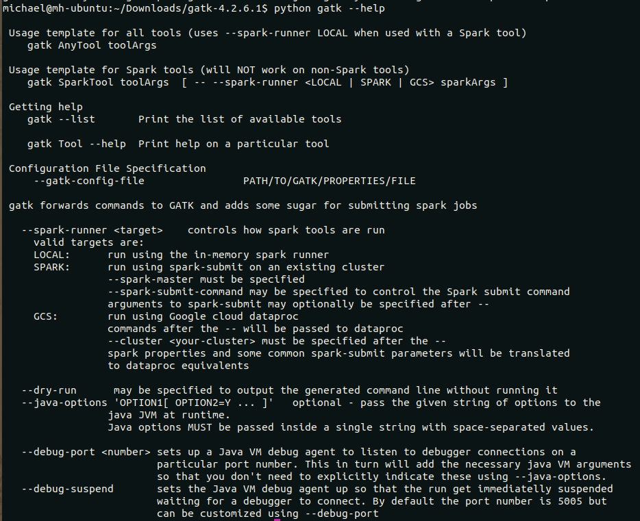
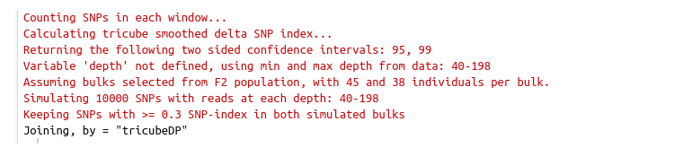
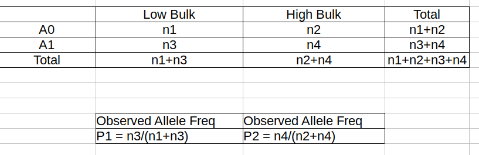
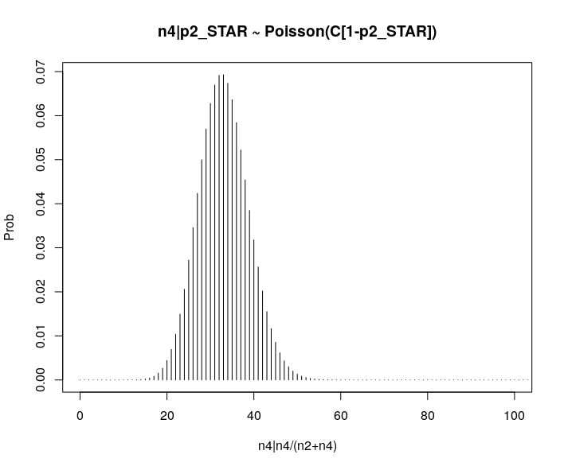

======================
QTL_BSA_Crop_Varieties
======================

:Author: Michael Hall
:Date:   4/13/2022

QTLSorghum
==========

QTLseqr is an R package for QTL mapping using NGS Bulk Segregant
Analysis.

QTLseqr is still under development and is offered with out any
guarantee.

**For more detailed instructions please read the vignette**\ `here <https://github.com/bmansfeld/QTLseqr/raw/master/vignettes/QTLseqr.pdf>`__
---------------------------------------------------------------------------------------------------------------------------------------------

For updates read the `NEWS.md <https://github.com/bmansfeld/QTLseqr/blob/master/NEWS.md>`__
-------------------------------------------------------------------------------------------

Installation
============

.. raw:: html

   <!-- You can install and update QTLseqr by using our [drat](http://dirk.eddelbuettel.com/code/drat.html) repository hosted on our github page: -->

.. raw:: html

   <!-- ```{r drat-install, eval = FALSE} -->

.. raw:: html

   <!-- install.packages("QTLseqr", repos = "http://bmansfeld.github.io/drat") -->

.. raw:: html

   <!-- ``` -->

.. raw:: html

   <!-- OR You can install QTLseqr from github with: -->

You can install QTLseqr from github with:

.. code:: r

   # install devtools first to download packages from github
   install.packages("devtools")

   # use devtools to install QTLseqr
   devtools::install_github("PBGLMichaelHall/QTLseqr")


Package Dependencies
--------------------

**Note:** Apart from regular package dependencies, there are some
Bioconductor tools that we use as well, as such you will be prompted to
install support for Bioconductor, if you haven’t already. QTLseqr makes
use of C++ to make some tasks significantly faster (like counting SNPs).
Because of this, in order to install QTLseqr from github you will be
required to install some compiling tools (Rtools and Xcode, for Windows
and Mac, respectively).


Citation
========

**If you use QTLseqr in published research, please cite:**

   Mansfeld B.N. and Grumet R, QTLseqr: An R package for bulk segregant
   analysis with next-generation sequencing *The Plant Genome*
   `doi:10.3835/plantgenome2018.01.0006 <https://dl.sciencesocieties.org/publications/tpg/abstracts/11/2/180006>`__

We also recommend citing the paper for the corresponding method you work
with.

QTL-seq method:

   Takagi, H., Abe, A., Yoshida, K., Kosugi, S., Natsume, S., Mitsuoka,
   C., Uemura, A., Utsushi, H., Tamiru, M., Takuno, S., Innan, H., Cano,
   L. M., Kamoun, S. and Terauchi, R. (2013), QTL-seq: rapid mapping of
   quantitative trait loci in rice by whole genome resequencing of DNA
   from two bulked populations. *Plant J*, 74: 174–183.
   `doi:10.1111/tpj.12105 <https://onlinelibrary.wiley.com/doi/full/10.1111/tpj.12105>`__

G prime method:

   Magwene PM, Willis JH, Kelly JK (2011) The Statistics of Bulk
   Segregant Analysis Using Next Generation Sequencing. *PLOS
   Computational Biology* 7(11): e1002255.
   `doi.org/10.1371/journal.pcbi.1002255 <http://journals.plos.org/ploscompbiol/article?id=10.1371/journal.pcbi.1002255>`__

Abstract
--------

Next Generation Sequencing Bulk Segregant Analysis (NGS-BSA) is
efficient in detecting quantitative trait loci (QTL). Despite the
popularity of NGS-BSA and the R statistical platform, no R packages are
currently available for NGS-BSA. We present QTLseqr, an R package for
NGS-BSA that identifies QTL using two statistical approaches: QTL-seq
and G’. These approaches use a simulation method and a tricube smoothed
G statistic, respectively, to identify and assess statistical
significance of QTL. QTLseqr, can import and filter SNP data, calculate
SNP distributions, relative allele frequencies, G’ values, and
log10(p-values), enabling identification and plotting of QTL.

Examples:
=========

Load/install libraries
----------------------

.. code:: r 

   devtools::install_github(“PBGLMichaelHall/QTLseqr”,force = TRUE) 
   install.packages(“vcfR”) 
   install.packages(“tidyr”) 
   install.packages(“ggplot2”)
    
   library(QTLseqr) 
   library(vcfR) 
   library(tidyr)
   library(ggplot2)

::

**Methods**


Set the Working Directory
-------------------------
   

.. code:: r 

   setwd("/home/michael/Desktop/QTLseqr/extdata")

Pre-Filtering Rules
===================

.. code:: r

   Vcf file must only contain bialleleic variants. (filter upstream, e.g., with bcftools view -v snps -m2 -M2), also the QTLseqR functions will only take    SNPS, ie, length of REF and ALT== 1

::

Importing Data
==============

importFromVCF
-------------

.. code:: r

   df <- importFromVCF(file = "freebayes_D2.filtered.vcf", highBulk = "D2_F2_tt", lowBulk =    "D2_F2_TT", filname = "Hall")

::

importFromGATK
--------------

   An offical Github GATK Genomic Analysis Toolkit repository can be found here to download 
   https://github.com/broadinstitute/gatk


   **However, we want to clone the repository and make a build:**

.. code:: r

   git clone https://github.com/broadinstitute/gatk


   **Navigate to find gradlew and type the command:**   

.. code:: r

   gradlew bundle


   **To verify it is working invoke python interpreter:** 

.. code:: r

   python gatk --help




.. code:: r

   python gatk --list
   
::


   *Base Calling:*
   *Copy Number Variant Discovery:*
   *Coverage Analyis:*
   *Diagnostics and Quality Control:*
   *Example Tools:*
   *Genotyping Arrays Manipulation:*
   *Intervals Manipulation:*
   *Metagenomics:*
   *Methalation-Specific Tools:*
   *Other:*
   *Read Data Manipulation:*
   *Reference:*
   *Short Variant Discovery:*
   *Structural Variant Discovery:*
   *Variant Evaluation and Refinement:*
   *Variant Filtering:*
   *Variant Manipulation:*
   
# We are most concerned with **Variant Evaluation and Refinement**

   
.. figure:: ../images/gatk2.png
   :alt: 
   
   
   
   


   **To produce the input file Hall.table, run the following command:**

.. code:: r

   python gatk VariantsToTable --variant freebayes_D2.filtered.vcf --fields CHROM --fields POS --fields REF --fields ALT --genotyp-fields AD --genotype-fields DP --genotype-fields GQ --genotype-fields PL --output Hall.table

::


Input Fields ImportFromVCF
==========================

.. code:: r

   **Define High bulk and Low bulk sample names as an input object and define parser generated file name. The file name is generated from ImportFromVCF function.**

   HighBulk <- "D2_F2_tt"
   LowBulk <- "D2_F2_TT"
   file <- "Hall.csv"

   **Choose and define which chromosomes/contigs will be included in the analysis. The chromosome/contg names are reverse compatible with VCF names.**

   Chroms <- c("Chr01","Chr02","Chr03","Chr04","Chr05","Chr06","Chr07","Chr08","Chr09","Chr10")


importFromTable
---------------

.. code:: r

   df <-
     importFromTable(
       file = file,
       highBulk = HighBulk,
       lowBulk = LowBulk,
       chromList = Chroms
     ) 


 

Inspect Header
--------------


Input Fields ImportFromGATK
==========================

.. code:: r

   **Define Objects High bulk, Low bulk and file given there proper names.**

   HighBulk <- "D2_F2_tt"
   LowBulk <- "D2_F2_TT"
   file <- "Hall.table"

   **Choose which chromosomes/contigs will be included in the analysis.**

   Chroms <- c("Chr01","Chr02","Chr03","Chr04","Chr05","Chr06","Chr07","Chr08","Chr09","Chr10")


importFromTable
---------------

.. code:: r

   df <-
     importFromGATK(
       file = file,
       highBulk = HighBulk,
       lowBulk = LowBulk,
       chromList = Chroms
     ) 

Histograms
----------


.. code:: r

   **Make histograms associated with filtering arguments. Such as Minimum Depth, Maximum Depth, Reference Allele Frequency, Minimum Sample Depth, and Genotype Quality.
   
   ggplot(data =df) + geom_histogram(aes(x = DP.LOW + DP.HIGH)) + xlim(0,400)
   
   
   ggsave(filename = "Depth_Histogram.png",plot=last_plot())


.. code:: r

   ggplot(data = df) + geom_histogram(aes(x = REF_FRQ))
   ggsave(filename = "Ref_Freq_Histogram.png",plot = last_plot())


filterSNPs
==========

.. code:: r

   **Filter SNPs:**
   df_filt <- filterSNPs( SNPset = df,
   refAlleleFreq = 0.20, minTotalDepth = 100, maxTotalDepth = 400,
   minSampleDepth = 40, 
   minGQ = 0 )


runGprimeAnalysis_MH
====================

.. code:: r

   **Run G' analysis:**
   
   df_filt<-runGprimeAnalysis_MH(
     SNPset = df_filt,
     windowSize = 5000000,
     outlierFilter = "deltaSNP",
     filterThreshold = 0.1)

.. figure:: ../images/11.png
   :alt: 

 

plotGprimeDist_MH
==================

.. code:: r

   **The plot reveals a skewed G Prime statistic with a really small variance. Perhaps it is due to relatively High Coverage with respect to Bulk Sample Sizes and not a lot of variants called.**
   
   **In addition, Hampels outlier filter in the second argument can also be changed to "deltaSNP".**
   
   plotGprimeDist(SNPset = df_filt, outlierFilter = "Hampel",filterThreshold = 0.1, binwidth = 0.5)

.. figure:: ../images/12.png
   :alt: 


.. code:: r

   **We can see raw data before and after our filtering step**
   
   plotGprimeDist_MH(SNPset = df_filt, outlierFilter = "deltaSNP",filterThreshold = 0.1,binwidth=0.5)


runQTLseqAnalysis_MH
====================

.. code:: r
   

   **Run QTLseq analysis:**
   
   
   df_filt2 <- runQTLseqAnalysis_MH(
     SNPset = df_filt,
     windowSize = 5000000,
     popStruc = "F2",
     bulkSize = c(45, 38),
     replications = 10000,
     intervals = c(95, 99)
   )




Plot G Statistic Distribution as a Histogram
--------------------------------------------

.. code:: r

   hist(df_filt2$G,breaks = 950,xlim = c(0,10),xlab = "G Distribution",main = "Histogram of G Values")


plotQTLStats
============


nSNPs
-----

.. code:: r

   **Plot Snps as a function of chromosome and position values**
   
   
   plotQTLStats(SNPset = df_filt2, var = "nSNPs")
   ggsave(filename = "nSNPs.png",plot = last_plot())


 
Gprime
------

.. code:: r

   **Using QTLStats funciton plot Gprime Statistic with False Discovery Rate Threhshold as a third argument boolean operator as TRUE. The q value is used as FDR threshold null value is 0.05%.**
   
   
   plotQTLStats(SNPset = df_filt, var = "Gprime", plotThreshold = TRUE, q = 0.01)
   ggsave(filename = "GPrime.png",plot = last_plot())


deltaSNP
--------

.. code:: r

   **Again using plotQTLStats change second argument varaible to deltaSNP and plot.**
   
   plotQTLStats(SNPset = df_filt2, var = "deltaSNP", plotIntervals  = TRUE)
   ggsave(filename = "DeltaSNPInterval.png",plot = last_plot())


negLog10Pval
------------

.. code:: r

   **Finally with plotQTLStats plot negLog10Pval.**
   
   plotQTLStats(SNPset = df_filt2, var = "negLog10Pval",plotThreshold = TRUE,q=0.01)
   ggsave(filename = "negLog10Pval.png",plot = last_plot())


   
Gprime Subset
-------------

.. code:: r

   **Add subset argument to focus on particular chromosomes one, three, four, and six.**
   **The reason is due to signficant QTL regions**
   
   
   plotQTLStats(SNPset = df_filt2, var = "Gprime",plotThreshold = TRUE,q=0.01,subset = c("Chr01","Chr03","Chr04","Chr06"))


rMVP Package
============

SNP Densities
--------------

.. code:: r

   install.packages("rMVP")
   library(rMVP)
   sample<-"Semi_Dwarfism_in_Sorghum"
   pathtosample <- "/home/michael/Desktop/QTLseqr/extdata/subset_freebayes_D2.filtered.vcf.gz"
   out<- paste0("mvp.",sample,".vcf")
   memo<-paste0(sample)
   dffile<-paste0("mvp.",sample,".vcf.geno.map")

   message("Making MVP data S1")
   MVP.Data(fileVCF=pathtosample,
         #filePhe="Phenotype.txt",
         fileKin=FALSE,
         filePC=FALSE,
         out=out)
         
   message("Reading MVP Data S1")
   df <- read.table(file = dffile, header=TRUE)
   message("Making SNP Density Plots")
   MVP.Report.Density(df[,c(1:3)], bin.size = 5000000, col = c("blue", "yellow", "red"), memo = memo, file.type = "jpg", dpi=300)


 

Export summary CSV
==================

.. code:: r

   QTLTable(SNPset = df_filt, alpha = 0.01, export = TRUE, fileName = "my_BSA_QTL.csv")

Preview the Summary QTL
-----------------------


Theory
======


Contigency Table
----------------





 
Obs_Allel_Freq
--------------

.. code:: r

   **Use the function to plot allele frequencies per chromosome.**
   **Second argument size specifes size of scalar factor on nSNPs and if you have a relatively small SNP set .001 is a good startin point otherwise set to 1**
   
   
   Obs_Allele_Freq(SNPSet = df_filt, size = .001)


   
   
Obs_Allele_Freq2
----------------

.. code:: r

   **Use the function to investigate chromosomal region of interest**
   
   Obs_Allele_Freq2(SNPSet = df_filt, ChromosomeValue = "Chr04", threshold = .90)


Total Coverage and Expected Allelic Frequencies
-----------------------------------------------

.. code:: r

   E(n1) = E(n2) = E(n3) = E(n4) = C/2


   **Read in the csv file from High bulk tt**
   
   tt<-read.table(file = "D2_F2_tt.csv",header = TRUE,sep = ",")
   
   **Calculate average Coverage per SNP site**
   
   mean(tt$DP)
   
   **Find REalized frequencies**
   
   p1_STAR <- sum(tt$AD_ALT.) / sum(tt$DP)

   **Read in the csv file from Low Bulk TT.**
   
   TT<-read.table(file ="D2_F2_TT.csv",header = TRUE,sep=",")
   
   **Calculate average Coverage per SNP sit**
   
   mean(TT$DP)
   
   **Find Realized frequencies**
   
   p2_STAR <- sum(TT$AD_ALT.) / sum(TT$DP)
   
   **Take the average of the Averages**
   
   C <-(mean(tt$DP)+mean(TT$DP))/2
   
   C<-round(C,0)
   **Find Coverage Value**
   C
   110
   
   E(n1) = E(n2) = E(n3) = E(n4) = C/2 = 55

   p2 >> p1 QTL is present


   
Theory and Analytical Framework of Sampling from BSA
====================================================
   

   
Binomial Sampling
-----------------
   
High Bulk
---------
   
   
   par(mfrow=c(1,1))
   **Define Ranges of Success**
   success <- 0:90
   
   **The Difference between realized and Expected Frequencies**
   
   **ns : Sample Size taken from Low Bulk**
   
   **2(ns)p1_star ~ Binomial(2(ns),p1)**
   
   **p1 Expected Frequencies**
   
   **Expected Frequencies:**
   
   **E(n1) = E(n2) = E(n3) = E(n4) = C/2 = 110**
   
   
   **We prefer for accuracy and a powerful G Prime Test to have ns >> C >> 1**
  
   **However, it is not true in this case.**
   
   plot(success, dbinom(success, size = 90, prob = .50), type = "h",main="Binomial Sampling from Diploid Orgainism from High Bulk",xlab="2(ns)(p1_STAR)",ylab="Density")


Low Bulk
--------

.. code:: r


   **ns : Sample Size from High Bulk**
   **2(ns)p2_star ~ Binomial(2(ns),p2)**
   **p2 Expected Frequencies**
   success <- 0:76
   plot(success, dbinom(success, size = 76, prob = 0.5), type = "h",main="Binomial Sampling from Diploid Organism from Low Bulk",xlab="2(n2)(p2_STAR)",ylab="Density")

.. figure:: ../images/26.png
   :alt: 

 
Conditional Distribution of n1 given realized average frequency
---------------------------------------------------------------

.. code:: r

   par(mfrow=c(1,1))
   #Define Ranges of Success (Allele Frequencies High and Low)
   success <- 0:100
   #n1|p1_star ~ Poisson(lambda)
   plot(success, dpois(success, lambda = C*(1-p1_STAR)), type = 'h',main="n1|p1_STAR ~ Poisson(C[1-p1_STAR])",xlab="n1|(n3/n1+n3)",ylab="Prob")


Observed n1
-----------

.. code:: r

   hist(TT$AD_REF., probability = TRUE,main="Histogram of Actually Realized n1 Values",xlab="n1")


Conditional Distribution of n2 given realized average frequency
---------------------------------------------------------------

.. code:: r

   #n2|p2_star ~ Poisson(lambda)
   plot(success, dpois(success, lambda = C*(1-p2_STAR)), type='h', main="n2|p2_STAR ~ Poisson(C[[1-p2_STAR])",xlab="n2|(n4/n2+n4)",ylab="Prob")


Observed n2
-----------

.. code:: r

   hist(tt$AD_REF., probability = TRUE, main = "Histogram of Actually Realized n2 Values",xlab="n2")


Conditional Distribution of n3 given realized average frequency
--------------------------------------------------------------- 

.. code:: r

   #n3|p1_star ~ Poisson(lambda)
   plot(success, dpois(success, lambda = C*p1_STAR),type='h',main="n3|p1_STAR ~ Poisson(C[1-p1_STAR])",xlab="n3|(n3/n1+n3)",ylab="Prob")


Observed n3
-----------

.. code:: r

   hist(TT$AD_ALT., probability = TRUE, main="Histogram of Acutally Realized n3 Values",xlab="n3")


Conditional Distribution of n4 given realized average frequency
--------------------------------------------------------------- 

.. code:: r

   #n4|p2_star ~ Poisson(lambda)
   plot(success, dpois(success, lambda = C*p2_STAR), type = 'h',main="n4|p2_STAR ~ Poisson(C[1-p2_STAR])",xlab="n4|n4/(n2+n4)",ylab="Prob")



Observed n4
-----------

.. code:: r

   hist(tt$AD_ALT., probability = TRUE, main="Histogram of Acutally Realized n4 Values",xlab="n4")


